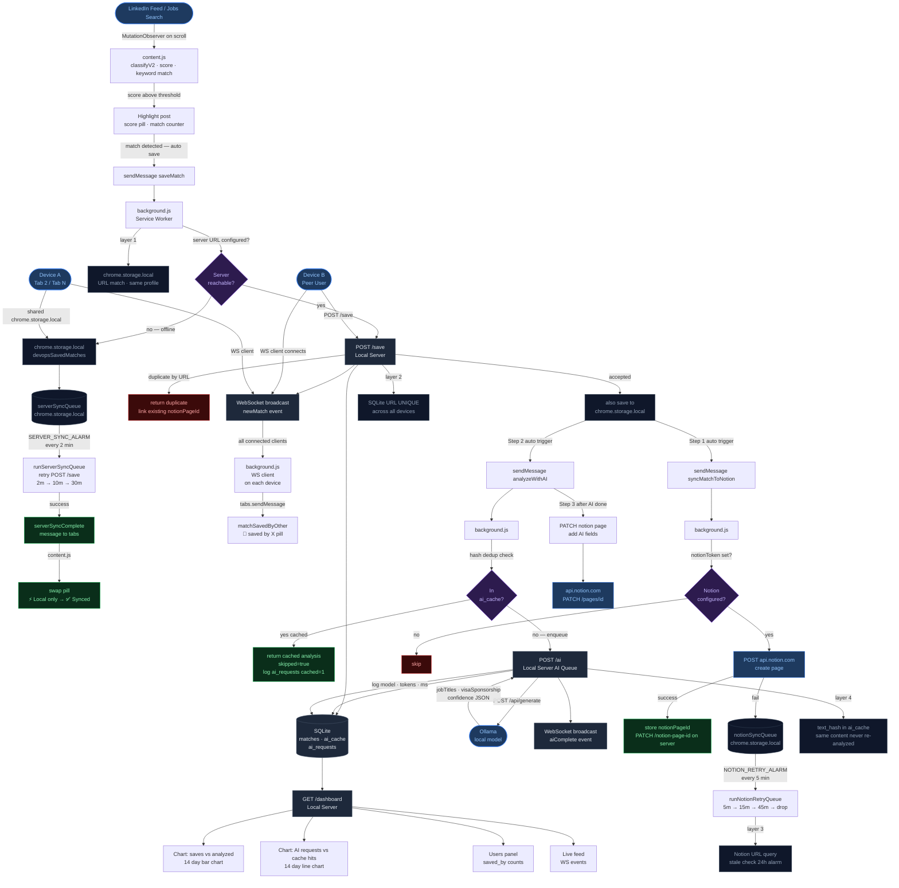

# LinkedIn DevOps Role Scanner

A Chrome extension that scans your LinkedIn feed for DevOps job posts, scores them, syncs them to Notion, and uses a local AI model to extract structured data.

---

## Data Flow



---

## Installation

1. Clone or download this repo
2. Open Chrome and go to `chrome://extensions`
3. Enable **Developer mode** (top right toggle)
4. Click **Load unpacked** and select the project folder
5. The extension icon will appear in your toolbar

---

## Features

### Scanning & Matching
- Automatically scans LinkedIn feed posts as you scroll
- Uses a two-pass classifier (V2) with sentence-level context, negation detection, and confidence scoring
- Highlights matched posts with a colored border and score pill
- Shows a match counter on each post indicating how many keywords were hit
- Dims posts you have already marked as Applied

### Relevance Score
Each matched post gets a score pill (green/yellow/red) based on confidence:
- Considers DevOps keywords, hiring signals, and context
- Hover over the pill to see which signals fired

### Auto-Scroll
- Automatically scrolls your LinkedIn feed and scans posts hands-free
- Toggle with the popup switch or keyboard shortcut `Cmd+Shift+S` (Mac) / `Ctrl+Shift+S` (Windows)

### Saved Matches
- Save any matched post with one click
- View all saved matches at **Saved Matches** → table with role, experience level, VISA status, keywords, and score
- Mark posts as Applied, Interested, Interviewing, etc.
- Stale posts (404/410) are flagged automatically every 24 hours

### Gmail Draft
- One-click button to open a Gmail compose window pre-filled for a job post
- Emails are extracted from the post body only (not comments)

---

## Notion Setup

Notion sync saves every matched post to a Notion database and keeps it updated.

### 1. Create a Notion Integration
1. Go to [https://www.notion.so/my-integrations](https://www.notion.so/my-integrations)
2. Click **New integration**, give it a name, select your workspace
3. Copy the **Internal Integration Token** (starts with `secret_...`)

### 2. Create a Database
Create a Notion database with these properties (exact names and types):

| Property | Type |
|---|---|
| Name | Title |
| Keywords | Text |
| Score | Number |
| Status | Status |
| Emails | Text |
| Date | Date |
| Snippet | Text |
| URL | URL |
| Job Title | Text |
| Experience Level | Text |
| VISA | Text |
| AI Confidence | Number |

### 3. Share the Database with Your Integration
- Open the database in Notion
- Click **...** menu → **Add connections** → select your integration

### 4. Get the Database ID
The database ID is in the URL:
```
https://www.notion.so/yourworkspace/THIS-IS-THE-DATABASE-ID?v=...
```
Copy the 32-character ID (with or without hyphens).

### 5. Save Credentials in Extension Settings
- Open the extension popup → **Settings**
- Scroll to **Notion** section
- Paste your token and database ID → **Save**
- Click **Test Connection** to verify

Once configured, every new saved match syncs to Notion automatically. Use **Test Sync** in the popup to verify the connection at any time.

---

## Local AI Setup (Ollama)

The extension uses a local AI model via [Ollama](https://ollama.com) to extract structured fields from post text:
- **Job Title** — the exact role being hired for
- **Experience Level** — junior / mid / senior / lead / any
- **VISA Sponsorship** — e.g. "H1B sponsored", "No H1B", "GC/Citizen only", "OPT/CPT accepted"
- **AI Confidence** — 0–100 score

### 1. Install Ollama

```bash
curl -fsSL https://ollama.com/install.sh | sh
```

Or download the Mac app from [ollama.com](https://ollama.com).

### 2. Pull a Model

Recommended (lightweight, good JSON extraction):
```bash
ollama pull qwen2.5:3b
```

Smaller option if resources are tight:
```bash
ollama pull qwen2.5:0.5b
```

### 3. Start Ollama with Chrome Extension Access

Chrome extensions are blocked by Ollama's CORS policy by default. Start it with:

```bash
OLLAMA_ORIGINS="chrome-extension://*" ollama serve
```

To stop any running Ollama instance first:
```bash
pkill ollama
# or if the port is stuck:
kill -9 $(lsof -ti:11434)
```

If you use the Ollama Mac menu bar app, quit it from the menu bar icon before running the command above.

### 4. Configure in Extension Settings
- Open the extension popup → **Settings**
- Scroll to **Ollama** section
- Set **URL**: `http://localhost:11434`
- Set **Model**: `qwen2.5:3b` (or whichever model you pulled)
- Click **Test Connection** to verify

### 5. Processing Matches

**New matches** are analyzed automatically after being saved.

**Existing / backfill**: Click **Process Unanalyzed** in Settings. This will:
1. Fetch all pages from your Notion database
2. Find any match missing AI fields (`jobTitle`, `experienceLevel`, `visaSponsorship`)
3. Run them through Ollama and PATCH the results back to Notion

You can stop mid-run with the **Stop** button and resume later.

AI scan progress is shown in the popup widget (e.g. `🤖 AI Scanned 12 / 34`).

---

## Settings Reference

| Setting | Description |
|---|---|
| Ollama URL | Base URL of your Ollama instance (default: `http://localhost:11434`) |
| Ollama Model | Model name to use for analysis (e.g. `qwen2.5:3b`) |
| Notion Token | Your Notion integration token (`secret_...`) |
| Notion Database ID | ID of the target Notion database |

---

## Troubleshooting

**Extension not scanning posts**
- Make sure you are on `linkedin.com/feed` or a LinkedIn search page
- Refresh the page after installing or updating the extension

**Notion sync failing with 401**
- Your token is invalid or expired — regenerate it at notion.so/my-integrations and re-save in Settings

**Notion sync failing with 400**
- Check that all database property names and types match the table above exactly

**Ollama returning 403**
- Ollama must be started with `OLLAMA_ORIGINS="chrome-extension://*"` — a plain `ollama serve` will be blocked

**Ollama returning 500**
- The model may not be pulled yet — run `ollama pull <model-name>`
- If Ollama was installed via Homebrew and broke: `brew uninstall ollama && curl -fsSL https://ollama.com/install.sh | sh`

**Port 11434 already in use**
```bash
kill -9 $(lsof -ti:11434)
```
